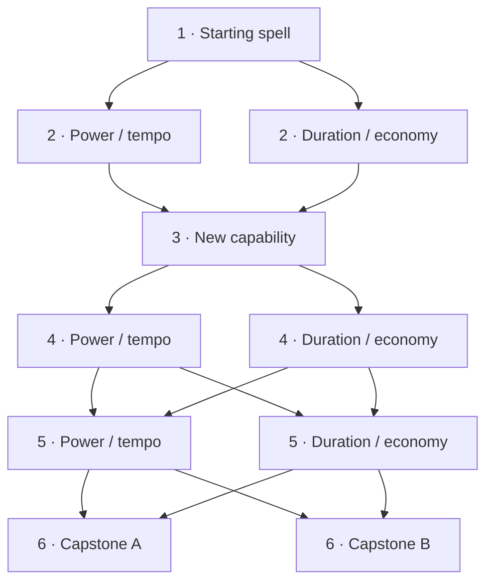

# Race, stat-budget and primary-spell redesign — proposed design plan

## Confirmed user direction

The current14 spells are the **first content pack**, not the complete future catalog. Races were designed for the old spells and need redesign. Every character always has two primary spells: Magic Arrow and Mirror Reflection, plus a progressing set of additional slots, starting at3 and reaching6 (Human starts at4 and reaches7). Magic Arrow primarily breaks mirrors and should deal only1–2 damage. The user selects primary progression with a weaker start, six levels, a branching graph and additional effects at checkpoints3 and6. Mirror should gain reflection of debuffs and periodic spells at level3. The earlier direction preserves100% protection against the intercepted spell; the user suggested25% initial return, then requested a weaker baseline. The proposed10% return below is not yet approved. Human starts with4 additional slots. Exact node bonuses, unlock pacing and capstone effects remain proposed. The user requested a plan, not immediate implementation.

This supersedes the assumption in [[2026-09-08-balance-review]] that the present neutral catalog should define the permanent racial design. Its measurements remain valid for today's pack and code; they are not evidence that future elemental design should be abandoned.

## Recommended architecture

Use three independently understandable layers:

1. **Stats** determine investment in survival, spell power/resources and tempo. Same spendable budget for every race; soft diminishing returns prevent a single-stat extreme from dominating.
2. **Race** supplies a small set of recognizable mechanical affinities/tradeoffs. It does not forbid stat allocations or rely exclusively on content absent from the first pack.
3. **Loadout** has two permanent primary roles plus3–6 drafted/selected spells (Human7). Primary spells have two development branches each; collection and slot entitlement remain separate.

This is a design proposal. Coefficients, new race passives and primary progression coefficients below have not been balance-tested or approved for implementation.

## 1. Stat budget and caps

### Current behavior

`Character.AllocateStatPoints` computes new effective stats and calls `ValidateEffectiveStatLimits` before mutation. Race ceilings apply after every level-up allocation, not just creation. Race floors are checked too, though positive-only allocation cannot reduce a valid stat below its floor. Restrictive ceilings indirectly force remaining points into another stat. See the audit's level30 examples: Orc STR≥405, Dark Elf INT≥385, Shadow DEX≥315 when every point is spent.

### Options

- **Permanent race-specific hard bounds:** strongest enforced archetypes, but creates allocation traps, invalidates desired builds and makes future content harder to integrate. Not recommended for the redesign.
- **Race bounds only at creation:** more later freedom, but creation remains restrictive and players may have to level out of an unwanted build. Better than current, still not the recommended default.
- **Shared stat budget, recommended race presets and soft diminishing returns:** best fit for expanding content and player-built characters. Recommended.

### Proposed rule

- Preserve a shared base budget:400 at creation and5 per level, up to545 spendable base points at the current level30 cap. Revising the XP curve is a separate task; do not change allocation pace accidentally.
- Replace mandatory racial STR/INT/DEX floors and ceilings with recommended editable starting presets. Maintain basic universal input bounds and enforce the earned budget server-side.
- Proposed initial universal minimum:10 per stat. All three stats remain useful for all races.
- Remove unequal flat racial point grants from the new design; express racial identity through traits. This yields the same total budget, not merely the same base budget with unequal hidden additions. If flat race stat bonuses are retained instead, they need an explicitly equalized budget before implementation; do not combine both models.
- Use a shared soft-cap curve on **combat benefits**, not a race-specific spending prohibition. Prototype effective benefit `x` up to200, then `200 + .5×(x−200)` above200. This is a simulation candidate, not a selected tuning coefficient. Show raw investment and derived effects separately so spending remains legible.
- Do not add a second race-specific total stat cap. Earned points already bound the total. Any future universal per-stat hard ceiling must leave all legally earned points spendable across the other stats.
- Start stat allocation with an immediate preview of HP, mana, damage/healing contribution, dodge and actual cast/recovery tick changes. DEX must buy observable value; investigate tempo/recovery scaling separately from changing the100 ms simulation tick.
- For existing characters, preserve XP, levels, skills, spell ownership and all earned points; grant a full reallocation under the new budget. Explain that old racial stat grants are replaced by traits. Do not silently clamp stored stats.

## 2. Race redesign for multiple content packs

Design one primary mechanic and, only if needed, one small secondary mechanic per race. A race's essential identity must function with the standard spells and pack1; future schools may expand its choices without creating its identity from nothing. Do not promise damage affinities to spells the player cannot obtain.

| Race | Proposed identity | Direction to prototype | Constraint |
|---|---|---|---|
| Human | versatility | extra optional spell slot; broad build freedom | remove universal neutral+20% damage; slot value grows with future collection size |
| Elf | mana management | efficient active meditation/resource recovery | avoid stacking huge mana, passive and active regen multipliers without a shared budget |
| Dark Elf | pressure and disruption | small reward for maintaining or exploiting hostile statuses, using poison/hex/control already in pack1 | one bounded trigger per spell/window; not a bonus per every periodic tick |
| Shadow | tempo and evasion | modest evasion plus a deliberate timing advantage | do not force DEX or make whole-match survival depend on25% package dodge |
| Gnome | spell efficiency | modest cost or cast-efficiency advantage with a visible tradeoff | account for ceil rounding on cheap spells; avoid best mana and cast speed simultaneously |
| Orc | durability and resistance to disruption | moderately higher survival / shorter control | stop making the same STR investment buy full damage and outsized HP; prototype all races using INT for spell power |

These are directions, not a list of all passives to apply together. For the first pass, keep primary effects themselves identical across races. Race identity should work without multiplying the combinations of race × primary allocation × future spell pack immediately.

Separate mechanical school/damage-type metadata from cosmetic nature. A future pack can introduce new mechanical affinities through explicit contracts. Do not infer them from names or silently repurpose lore fields. Test every new pack with the old one, not only in isolation.

## 3. Primary spells: a permanent tactical foundation

### Six levels in a branching directed acyclic graph

The user requested six primary levels with checkpoints at3 and6 and graph-based branching. This replaces the previous two-point/two-rank proposal.

Proposed graph rules:

- Level1 is the free starting node. Each primary has its own progression; its level is not the character level.
- Advancing to the next primary level selects exactly one eligible node in that tier. At level6 the character has a six-node path, never every node in the graph.
- Ordinary choice tiers are2,4 and5. Level3 is a shared capability checkpoint. Level6 offers a choice of capstone effects.
- Edges can branch and reconnect, allowing hybrid builds. Passing through a shared checkpoint preserves all previous selected node bonuses; merging the graph does not reset the build.
- Node bonuses below are **incremental** and accumulate along the selected path. Two nodes at the same tier are mutually exclusive. The same bonus type can be selected again at a later ordinary tier.
- Earn advancement from explicit progression milestones, not primary-cast spam. The XP redesign determines those milestones; no character-level mapping is implied by this six-level primary graph.
- Allow redistribution outside a match, validate a contiguous legal path server-side, and snapshot it at match entry. Each primary has an independent earned-level budget; neither consumes optional spell slots.
- Store versioned node IDs and graph definitions, not a growing set of bespoke character boolean flags. Runtime resolves one effective primary configuration. Add future branches without rewriting allocation logic, but explicitly migrate saved paths when existing nodes change or disappear.

This is a compact DAG with reconnection and hybrid paths, not two disconnected linear upgrade tracks. Later pack/race branches can introduce prerequisites, but the first version should keep the above small graph understandable.

### Mirror Reflection

**Proposed weaker level1 baseline:** one charge,1.5-second active window,10% returned direct damage, cost9, base cast.5s, recovery.4s. Full interception of one hostile package remains; it is never immunity to every attack during the window. The10%/1.5s values are new prototype candidates, not user-confirmed tuning.

- At levels1–2, intercept the entire incoming package and consume the mirror. Return only its direct-damage effects at the selected fraction. Debuffs, poison and delayed hex are blocked but not returned; a pure status/periodic spell therefore spends the mirror without producing an outgoing effect. Already-active statuses are not cleansed.
- **Level3 checkpoint:** unlock returning hostile debuffs, periodic damage and delayed damage. Status mechanics return fully; their damage uses the mirror's selected fraction. This avoids undefined fractional paralysis durations. Target-specific duration rules still apply to the final target. This detailed policy is proposed; the user requested the level3 gate.
- Ordinary levels2/4/5 each offer either **+30 percentage points of returned damage** or **+1 second of active duration**. These increments produce four final allocations:100%/1.5s,70%/2.5s,40%/3.5s,10%/4.5s, before the capstone. All retain one charge.
- **Level6 checkpoint:** choose one proposed extra effect:
  - **Counterstroke:** after successfully returning a non-primary hostile spell package, the next non-primary cast started within2 seconds has its cast duration reduced by100 ms, once. The duration remains at least100 ms. No trigger when Arrow breaks the mirror, when no outgoing effect exists, or when the outgoing package is dodged.
  - **Conservation:** if the mirror expires unused, refund `floor(actual mana paid / 2)`. No refund on consumption, Dispel, replacement, match end or any other removal reason. Reflecting/being broken by Arrow never qualifies as unused expiry.

Counterstroke is a separate proposed status with a short expiry, one consumption and no stacking. If another primary effect grants the same100 ms tempo benefit, keep only one; never add them into a larger bonus.

**Damage contract:** snapshot original caster offensive potency, multiply once by the selected return fraction, then apply the new target's mitigation once. Do not rescale with the reflector's stats. Reflected ownership changes for poison ownership and other interactions, but offensive potency remains separate. Capture the fraction and capability flags at interception for later poison pulses/hex detonation. No reflection chains. Arrow remains a1-damage utility hit when returned, an explicit minimum-damage exception, and always consumes a mirror before the final reflected target's dodge roll.

Every node preserves the core Arrow counter. No additional mirror charges, reflected-damage amplification above100%, or immunity to mirror-breaking.

### Magic Arrow

**Proposed weaker level1 baseline:** fixed1 damage, cost5, cast.8s, recovery.4s. The only confirmed damage direction is the user's1–2 target; these cost/timing values are candidates for simulation. The weaker start must still let Arrow contest a newly cast mirror with plausible reaction time; test the1.5-second initial mirror window and100 ms tick boundaries together.

- No damage scaling from STR/INT/Magery/school/race and no damage-growth branch. Shield and dodge keep their normal interactions; mirror consumption is reliable at every primary level.
- Ordinary levels2/4/5 each offer either **−100 ms base cast time** or **−1 base mana cost**. End allocations before capstones are.5s/cost5,.6s/cost4,.7s/cost3,.8s/cost2. This is a tempo/economy choice, not a growing damage attack.
- **Level3 checkpoint — Follow-through:** when this Arrow actually consumes a mirror, shorten its own remaining recovery by100 ms, never earlier than the current authoritative time. Ordinary hits, misses and shield hits do not qualify. If no recovery remains, nothing is shortened. This is a candidate additional effect, not approved behavior.
- **Level6 checkpoint:** choose one proposed extra effect:
  - **Opening:** after breaking a mirror, the next non-primary cast started within2 seconds is100 ms shorter, once, minimum100 ms. It uses the same non-stacking tempo effect as Mirror Counterstroke.
  - **Rebate:** breaking a mirror refunds1 mana, capped at the actual mana paid. An ordinary hit/miss earns nothing. Maximum economy still has a positive net cost under these prototype values.

Do not grant damaging-skill training for utility probing. Generic cost/cast racial modifiers, if retained, apply once and appear in effective metadata; no primary-specific racial overlay in the first graph iteration. Profile projection must not mutate catalog definitions. Special-case damage eligibility centrally rather than separately in each handler.

### What this prototype tests

The earlier primary model was weaker only in reflected damage. This prototype weakens initial return, window, Arrow speed and Arrow cost, then grants actual new capabilities at3/6. Because this changes early counter timing materially, verify the combined baseline before committing to these numbers. If Arrow can no longer reasonably break an observed mirror, adjust the starting window/cast pair; do not grant arbitrary counter immunity.

Keep exactly two primary spell identities. Unrestricted replacement, extra primary slots and racial graph overlays are deferred proposals, not part of this first implementation. New packs may expand graph content while preserving the shared tactical roles.

## 4. Slot and collection progression

User correction is explicit: **Human starts at4**, other races at3. Preserve starting ownership and the extra Human slot. User-requested slower unlocks replace the old4/8/12 ladder with proposed7/11/16:

| Level | Other races | Human |
|---|---:|---:|
|1|3|4|
|7|4|5|
|11|5|6|
|16|6|7|

Draft ownership must outgrow slot count: the user targets roughly6/10/15 known optional spells for4/5/6 slots through MP purchases. The front-loaded MP proposal, post-cap study rewards and skill milestones are in [[2026-09-08-xp-ranked-progression]]. A one-free-spell-per-slot model is withdrawn; the first pack only supplies12 optional spells.

The two primary spells are carried on top at every level. Primary development does not occupy optional slots. New packs expand the owned spell pool, not the maximum slot count. Human's extra starter and match slot are available from creation; the earlier proposed shared3-slot start is withdrawn.

## XP and ranked progression clarification

See [[2026-09-08-xp-ranked-progression]]. The user explicitly states that unfinished skills and Magic Points must not block ranked games. Skills continue to their individual caps after character level30; MP needs an earning source beyond level-ups. Proposed primary milestones1/5/10/16/23/30 are provisional and do not require all primary points to be spent for ranked eligibility. No automatic skill maximization or normalization is approved.

## 5. Delivery sequence and validation gates

### Phase A — isolate the primary utility role

Implement fixed Arrow damage and explicit scaling/training eligibility. Keep other primary timings stable. Update spell descriptions, server metadata and client display. Relevant files: `data/spells/magic_arrow.yaml`, `modules/spell_system/spell_effects/events.go`, effect handler tests, `modules/combat/damage.go` if a reusable scaling policy is introduced. Do not hardcode exceptions independently in multiple handlers.

Gate: Arrow damage remains1 across stats/skills/races, mirror interaction remains reliable, no resource or training exploit; compare tactical spell choice and match duration before/after. This phase does not wait for a complete race redesign.

### Phase B — shared stat and spell-power model

Prototype proportional spell-power scaling, shared budget, soft-cap curve, HP curve and DEX breakpoints in isolated simulations. Re-evaluate healing, shield and skill resistance alongside damage. Relevant modules: combat/profile/stats/damage, character validation/allocation/details, progression constants, race model, client stat allocation views.

Gate: legal balanced/specialized builds at levels1/4/8/12/30, skills0/50/100; every earned point remains allocatable; no Arrow scaling regression; competitive time-to-kill and sustainable mana checked independently.

### Phase C — races and migration

Select one working trait per race, establish a common power budget, test each in pack1 and with synthetic future-pack combinations. Update descriptions and add a **new** data migration rather than editing an already-applied seed migration. Deliver reallocation flow before switching saved characters to new caps/budgets. Preserve Human's4-slot/4-starter creation and4→7 entitlement.

Gate: all15 race pairings with multiple build archetypes, both seats, shared draft samples, alternate AI policies and targeted human playtests. Raw aggregate wins are insufficient. Test early Human separately, and test Human slot value again as new packs arrive.

### Phase D — six-level primary graphs and checkpoint effects

Define versioned DAGs with node tier, prerequisites/edges, mutually exclusive choices and typed modifiers/effects. Persist earned primary level separately from selected node IDs. Validate root, reachability, one node per tier, progression budget and graph version. Reject cycles/unreachable nodes in content validation. Resolve the selected path into an immutable match-entry configuration. Deliver outside-match redistribution and explicit handling of saved allocations when the graph changes.

Implement weaker baseline tuning and the selected checkpoint effects, effective tooltips and graph UI, reflection payload metadata and client/server catalog compatibility together. Define retrospective earned levels for existing characters from the final unlock policy. The user requested a design plan; exact character milestones and candidate node effects are not yet an approved implementation specification.

The effect context must distinguish original offensive potency from reflected ownership and retain the selected return fraction/capabilities through poison/hex scheduling. The checkpoint3 gate must block the unsupported original effect without inadvertently returning it. Conditional refunds must use actual paid mana and explicit lifecycle removal reasons. Tempo effects cannot stack and are consumed only by eligible casts.

Gate: all legal six-tier paths, beginner levels1/2, capability boundary2→3 and capstones5→6; full original interception, only eligible returns before3, full status-mechanic return after3, delayed damage fraction captured once; no reflection chain/extra charge; Arrow always breaks mirrors and damage stays1. Cover unused expiry vs consumption/dispel/match-end refunds, cast-time floor and queued-action timing. Compare equivalent primary progression and mixed novice/veteran progression across races. Human4→7 entitlement stays unchanged.

### Phase E — progression and content-pack compatibility

Revise XP/skill training pacing and matchmaking power policy. Extend balance tooling to all race pairs, explicit level/skill/build inputs, participation denominators and optional-content pools. Require every new pack to retain old primary counterplay and old races' basic viability.

Gate: collection growth does not expand optional slot count beyond6/7; no forced purchase of a new pack to obtain the basic mirror counter; monitor match duration, timeout, primary usage, successful counters and spell choices, not only damage totals.

## Source of truth in code

- `server:modules/character/{character,validate,details}.go` — allocation, race bounds, effective stat presentation.
- `server:modules/progression/{constants,spell_slots}.go` — current400/+5 budget and3/4→6/7 slot entitlement.
- `server:modules/combat/{profile,stats,damage}.go` — current flat scaling and race derivation.
- `server:modules/match/engine/phase/game/apply_spell_effect.go` — reflection before dodge, reassigned caster.
- `server:modules/spell_system/spell_effects/events.go` — damage calculation and gain attribution.
- `server:data/spells/{magic_arrow,mirror_reflection}.yaml` — primary defaults.
- `server:db/migrations/000002_reference_data.up.sql` — old race model requiring deliberate replacement.
- `server:modules/match/engine/core/player_setup.go`, `modules/spell_system/standard.go` — standard spells always present.
- `client:Core/Characters/StatAllocation.cs`, `client:Core/Match/DuelV2.cs` — client allocation and protocol integration to inspect before implementation.
